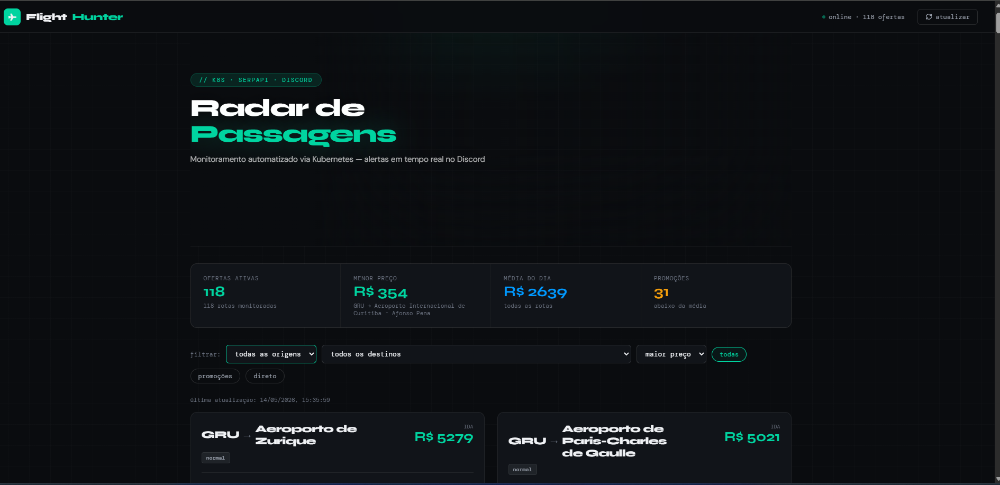
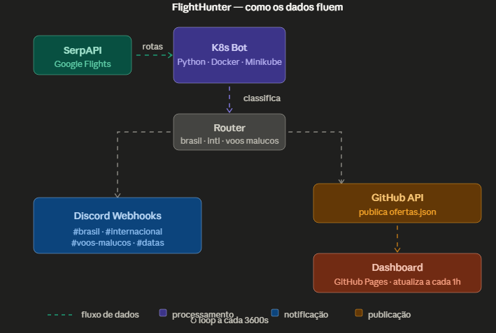
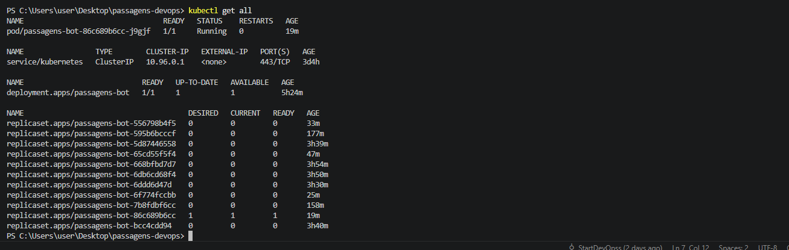
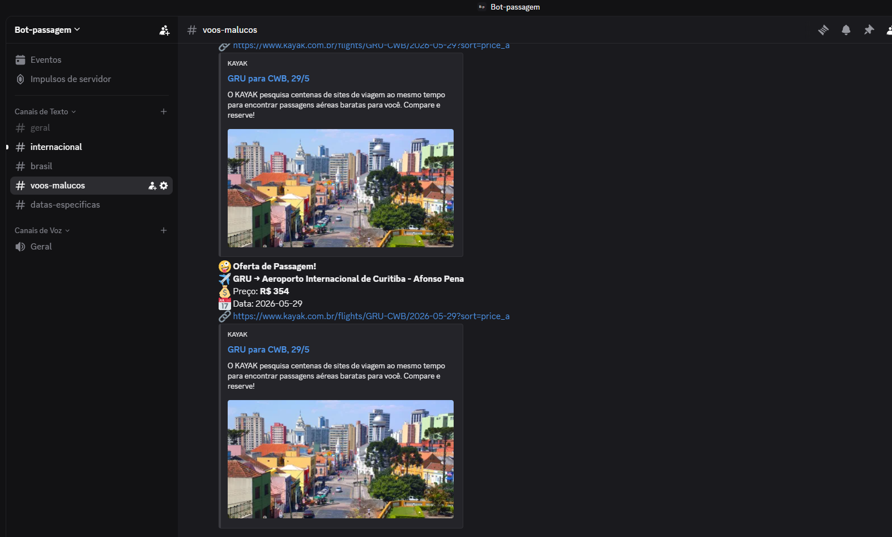

# ✈️ FlightHunter — Radar de Passagens Aéreas

> Sistema automatizado de monitoramento de passagens aéreas com alertas em tempo real no Discord, orquestrado via Kubernetes e com dashboard público no GitHub Pages.



---

## 🏗️ Arquitetura do Pipeline



O fluxo completo de dados:

```
SerpAPI (Google Flights)
        ↓
   K8s Bot (Python)
        ↓
     Router
    ↙      ↘
Discord   GitHub API
Webhooks       ↓
           GitHub Pages
           (Dashboard)
```

---

## ⚙️ Infraestrutura



- **Deployment** com `1/1` réplica sempre disponível
- **ReplicaSet** gerenciando o ciclo de vida dos pods
- **Zero downtime** em cada deploy via `kubectl rollout`
- Pod com `0` restarts — estável em produção

---

## 📣 Alertas no Discord



O bot classifica cada oferta e envia para o canal correto:

| Canal | Critério |
|---|---|
| `#brasil` | Voos domésticos dentro do limite de preço |
| `#internacional` | Voos internacionais dentro do limite |
| `#voos-malucos` | Internacional abaixo de R$ 1.500 ou doméstico abaixo de R$ 400 |
| `#datas-especificas` | Voos em datas comemorativas |
| `#geral` | Demais ofertas |

---

## 🛠️ Tecnologias

| Camada | Tecnologia |
|---|---|
| Linguagem | Python 3.10 |
| Containerização | Docker |
| Orquestração | Kubernetes (Minikube) |
| API de Voos | SerpAPI (Google Flights) |
| Notificações | Discord Webhooks |
| CI/CD | Build manual → kubectl rollout |
| Frontend | HTML5 · CSS · JavaScript |
| Hospedagem | GitHub Pages |

---

## 🚀 Como rodar localmente

### Pré-requisitos

- Docker
- Minikube
- kubectl
- Conta na [SerpAPI](https://serpapi.com)
- Webhooks do Discord configurados

### 1. Clone o repositório

```bash
git clone https://github.com/StartDevOpss/passagens-devops.git
cd passagens-devops
```

### 2. Configure as variáveis de ambiente

```bash
cp .env.example .env
# Edite o .env com suas chaves
```

```env
SERPAPI_KEY=sua_chave_aqui
GITHUB_TOKEN=seu_token_aqui
GITHUB_REPO=StartDevOpss/passagens-devops
DISCORD_WEBHOOK_GERAL=https://discord.com/api/webhooks/...
DISCORD_WEBHOOK_BRASIL=https://discord.com/api/webhooks/...
DISCORD_WEBHOOK_INTERNACIONAL=https://discord.com/api/webhooks/...
DISCORD_WEBHOOK_MALUCOS=https://discord.com/api/webhooks/...
DISCORD_WEBHOOK_DATAS=https://discord.com/api/webhooks/...
```

### 3. Build e deploy

```bash
# Build da imagem
docker build --no-cache -t passagens-bot:latest .

# Sobe o cluster
minikube start

# Aplica os manifestos
kubectl apply -f k8s/

# Verifica o status
kubectl get all
```

### 4. Acompanhe os logs

```bash
kubectl logs -f deployment/passagens-bot --tail=50
```

---

## 📁 Estrutura do projeto

```
passagens-devops/
├── src/
│   └── providers/
│       └── serpapi.py       # Busca voos na SerpAPI
├── k8s/                     # Manifestos Kubernetes
├── helm/                    # Helm charts
├── docs/
│   ├── index.html           # Dashboard (GitHub Pages)
│   ├── ofertas.json         # Dados gerados pelo bot
│   └── assets/              # Imagens do README
├── bot.py                   # Orquestrador principal
├── Dockerfile
└── requirements.txt
```

---

## 📄 Licença

MIT

---

*Projeto desenvolvido para portfólio em Engenharia de Plataforma / DevOps.*